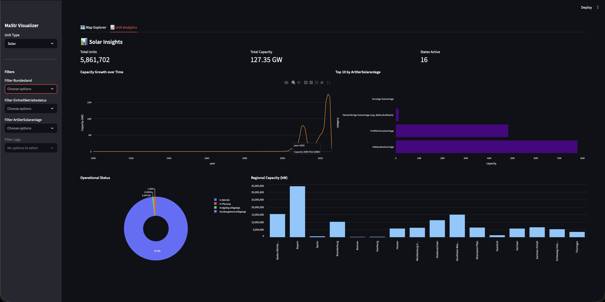
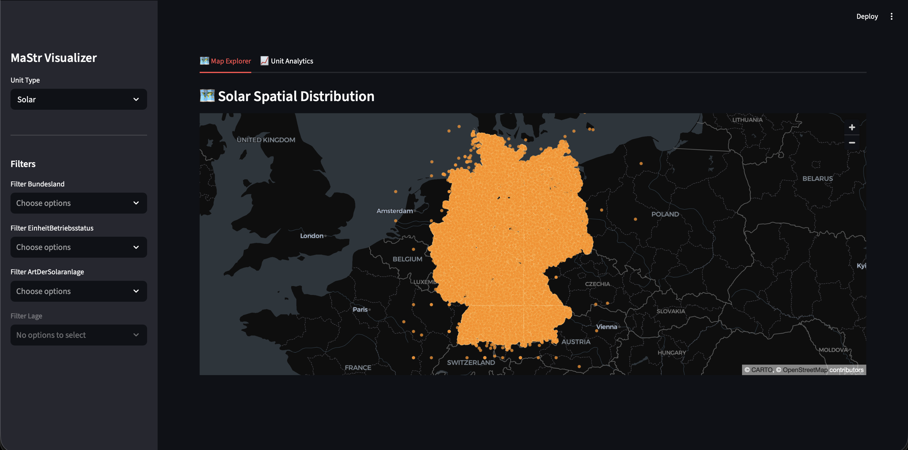

It started with a simple question that kept nagging at me while living in Cottbus, Brandenburg:



Where exactly is Germany’s energy infrastructure - and how is it evolving?



As someone watching the Energiewende unfold right in my region, new solar parks sprouting on former coal fields, wind turbines dotting the landscape. I wanted to see the big picture. The data already existed. In fact, *all* of it existed meticulously collected and published by the German Federal Network Agency in the **[Marktstammdatenregister (MaStR)](https://www.marktstammdatenregister.de/MaStR)**.

Millions of records describing power plants, storage systems, wind turbines, solar installations, operators, capacities, and locations.

But there was a problem.

The data was dense, fragmented, and difficult to explore intuitively. CSV files, XML dumps, database exports - excellent for compliance, terrible for insight.

That gap is where **[MaStr_Visualizer](https://github.com/fharookshaik/MaStr_Visualizer)** was born.

This post tells the story behind the project - the motivation, the architecture, the technical decisions, and the challenges that turned raw registry data into something you can actually *see* and interact with.


*<figcaption>Solar analytics view: total units, capacity growth over time, top installation types, operational status, and regional breakdown.</figcaption>*

---

## The Problem: Data Without Perspective

MaStR is comprehensive, but answering even simple questions is hard:

- Where are wind installations actually concentrated?
- How fast is solar capacity growing, and where?
- Which technologies dominate specific federal states?
- How does infrastructure evolve spatially over time?

Tables alone don’t answer these questions.

You need **maps**.  
You need **filters**.  
You need **speed at scale**.


*<figcaption>Interactive map explorer: millions of solar units rendered as WebGL points, showing spatial density at a glance.</figcaption>*

---

## The Vision

MaStr_Visualizer was built around three core goals:

1. Ingest large-scale official energy data
2. Serve it efficiently through a clean API
3. Render it interactively on a map - without sacrificing performance

This isn’t a static dashboard. It’s a system designed to scale, extend, and remain responsive even with millions of geospatial records.

---

## High-Level Architecture

![High Level Architecture Diagram](https://mermaid.ink/img/pako:eNqVVv9u2zYQfhVCQYsEs1NbjmNHGwbEcRoYiLE0druhdTEw0kkiQpEqSdVR0wx7lj3anmRH_bRnt2j8h0Xy7j4ev7vj8dHxZQCO54Rcrv2YKkOW05Ug-Hvxglw-GFCCcgLCMMNAlxKd3UWKpnEr_7BymvFCZspHVedjqW1_c7owt6hUfMktREyjdiv_LQyZz9D4ClRCBbkUoKIczdQ9GDKlhra6f7nHI3I1Ie9nN80eIIKVaNyeiQi0YVIQTvN6m8bpVooOWeiNletW__A2E5rgWsiUNkQb5CZLj7aOFTAFfmG4nLSrN0ri-TUTEW6QUG3Un5wZaBX-_fsfMpVrwSUNNHlJUqo0aPLH_HpbZ5FSwwr2FfPjBIOwLZ9k_J5YENyKrJmJCRMBPGxwv83LhVRATKwAuhhMRajyY3TMNxmuM6FZAOiXf79DWblY8FWOLmSSSo3akHKZt54dzjNuWNeXwlCGMSQafpC0dtTseqNAIzKtY7U1LyO1ifttbPt7rdAnpANxFkYBTTAkmFg6vpNUBdu6ltsZaiuKWJ-BvJ3tym_yKfj35He4u7rGPE31HhUuDc_JORZFbpivyYWtrz2K01zQhPmYaRw33a6cIoLfIek8TTnzG442p8-laEIxtgVDrzFpz29m9cqux7eXi2WYcYJKu8J3iC8VWTIOZAHqM6bB4fzd8mhXs6UGd0klE_vYmYOhgS3T7-ic61z4ZDohmHmiOl4qJcfCeBabxXVQXwvP5W86sUkqtYkULN5ck5-InVzNFrv-1pUdgUzAqBz95lki9pwMzZd1WZMQaQ0xNuRTBqq5jjfVl_SOV4prtOoQLTlV-MGI0Ag6BIx_vJ-S7bvircawsboIZCWwqx8K0UTJNX4_km73168rJzYm9V694tKnPMZTe-Nhr79yvjZ1twE9x6uBFBG1TadcrtXILyWeTTCbXQTxeHXOQ4MZpe1ZqMFPUuXFkd1mK1OrSY1VJoeuKH9JaJV1DYtoP53s7R-tgzVmCblULIqwVAnNjEwQ2LqZVxnV9IyNa9B2D7tP2xtK3XZeIbd9QdG1bQkFU9a06J3fsLouLNJyGQI8ZJkyQWO9dcCFyXnjgs-p1lMIy2ZpLyHuHcAgdMOgg71L3oN30B-eDv1eNe2uWWBiz00fOpi2UnkHvV7v5_-BQf0cKPHCMBxAr8GD8NTvPQuPtTEpHRyHQxg3gC6MgoH7o4BbraWzcWd2isLfeDWU6u07qBpsCttsaXx0Ok6kWOB4RmXQcRL7qLFT59EarhwTQwIrx8NhgE-clbMST2iTUvFeyqQ2UzKLYscLKdc4y1IMJUwZxZsqaVYV5iSoC5kJ43ijs7MCxPEenQfHOxkfn50N3MFJ_3R4guWIwtzxuv2-ezzAv6HbH_Td8ehs9NRxvhT79o9H_VHP7Y8Ho757OnIH7tN_MrY1dQ?type=png)

### Why These Tech Choices?

- **PostGIS**: Energy data is spatial by nature - GIST indexes and native vector tile support make bounding-box queries blazing fast.
- **FastAPI**: Async-first, automatic OpenAPI docs, and excellent performance for serving tiles and stats.
- **Streamlit + PyDeck**: Rapid prototyping with production-grade WebGL map rendering capable of handling millions of points smoothly.
- **mastr_lite**: Battle-tested library for parsing the official MaStR dumps.

With this stack, the map renders millions of points interactively even on modest hardware - no lag when panning or zooming across Germany.

---

## Data Layer: Treating Geography as a First-Class Citizen

Energy infrastructure is inherently spatial. PostGIS provides:

- Spatial indexing (GIST)
- Geometry-aware queries
- Fast bounding-box filtering
- Native vector tile (MVT) support

---

## Backend: FastAPI as the System Core

FastAPI was chosen for async performance and clean API design.

Key endpoints include:

```plaintext
/api/tiles/{unit_type}/{z}/{x}/{y}      # Vector tiles for the map
/api/stats/advanced/{unit_type}        # Aggregated analytics
/api/metadata/{unit_type}              # Filters and options
```

Example tile endpoint snippet:

```python
@app.get("/api/tiles/{unit_type}/{z}/{x}/{y}")
async def get_tiles(unit_type: str, z: int, x: int, y: int):
    bbox = tile_extent(z, x, y)
    query = f"""
        SELECT ST_AsMVT(q, '{unit_type}', 4096, 'geom')
        FROM (
            SELECT id, capacity, ST_AsMVTGeom(geom, TileBBox({z}, {x}, {y})) AS geom
            FROM {unit_type} WHERE geom && TileBBox({z}, {x}, {y})
        ) q
    """
    # async execution...
```

---

## Frontend: Streamlit, Used Intentionally

Streamlit + PyDeck enables:

- WebGL rendering for millions of points
- Smooth interaction and dynamic filtering
- Rapid iteration on analytics charts (Plotly)

---

## Challenges & Lessons Learned

- **Ingestion time**: The initial ~2.7 GB XML parse and load takes 30–60 minutes. Lesson: Made it optional/manual and added progress logging.
- **Geocoding quirks**: MaStR addresses aren’t always clean - relied heavily on open-mastr’s enrichment.
- **Streamlit scaling**: Great for prototyping, but heavy sessions need careful caching and async handling.

These hurdles taught me a lot about working with real-world open government data.

---

## Deployment

```bash
docker-compose up --build
```

The app runs locally at `http://localhost:8501`. Data persists in Docker volumes.

---

## Closing Thoughts

MaStr_Visualizer bridges the gap between raw registry data and real understanding. Sometimes, making data *visible* is all it takes to spark new questions - and maybe even better decisions during Germany’s energy transition.

If you're exploring the Energiewende, working with energy data, or just curious - try it out yourself! Feedback, issues, and contributions are very welcome.

🌟 Star the repo if you found this useful!

